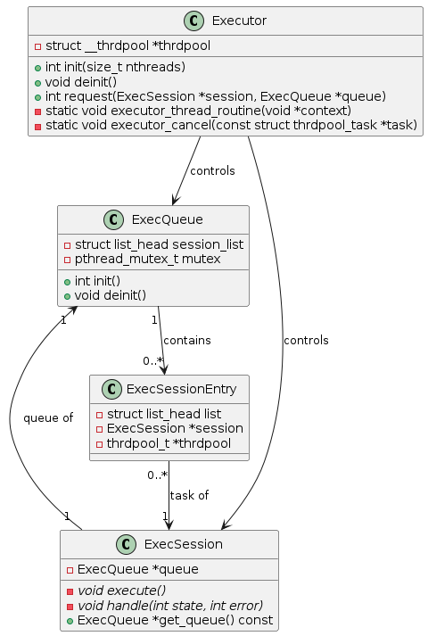

#! https://zhuanlan.zhihu.com/p/416556786
# workflow 源码解析 09 : Executor 

项目源码 : https://github.com/sogou/workflow

更加详细的源码注释可看 : https://github.com/chanchann/workflow_annotation


## 简介

无论是用何种计算硬件，
计算调度要解决的问题是：
1. 充分使用资源 ———— 充分调度CPU
2. 不同类别的任务的资源分配 ———— 灵活配置线程比例
3. 优先级管理 ———— 公平处理优先级

该模块主要功能是创建一个线程池，并能够对任务进行调度执行。当请求执行一个任务时，该任务会被添加到队列中，然后由线程池中的线程执行。此实现还包括处理任务取消的情况。



Executor内部有一个线程池和一个基本的主队列。而每个任务本身，同时也属于一个ExecQueue，其结构是一组以名字区分的子队列。
这种数据结构的组合，可以做到以下三点：

1.  首先，只要有空闲计算线程可用，
    任务将实时调起，计算队列名不起作用

2.  当计算线程无法实时调起每个任务时，
	那么同一队列名下的任务，
	将按FIFO的顺序被调起，
	而队列与队列之间则是平等对待

	例如，先连续提交n个队列名为A的任务，
	再连续提交n个队列名为B的任务，
	那么无论每个任务的cpu耗时分别是多少，
	也无论计算线程数多少，
	这两个队列将近倾向于同时执行完毕

3.  这个规律可以扩展到任意队列数量以及任意提交顺序

注意，这是一个线程安全的实现，它使用了`pthread`库中的互斥体（mutex）来确保在多线程环境中的安全操作。

## Executor接口

这段代码中定义的库对外主要提供了以下接口：

1. **ExecQueue 类**：任务队列
    - `init()`：初始化执行队列。
    - `deinit()`：销毁执行队列。

2. **ExecSession 类**：这是一个关于任务的抽象基类
    - `execute()`：抽象方法，需要子类具体实现。此方法用于定义任务的执行内容。
    - `handle(int state, int error)`：抽象方法，需要子类具体实现。此方法用于处理任务执行的结果。

3. **Executor 类**：这个类主要负责管理和调度任务。
    - `init(size_t nthreads)`：创建线程池，线程池大小由参数`nthreads`决定。
    - `deinit()`：销毁线程池。
    - `request(ExecSession *session, ExecQueue *queue)`：将一个ExecSession对象的任务添加到ExecQueue对象的任务队列中，该任务随后会被线程池中的一个线程执行。

这些接口可以让用户创建一个执行队列，添加并执行任务，以及销毁执行队列和线程池。用户需要继承ExecSession类，并实现其抽象方法`execute()`和`handle()`，以定义具体的任务执行内容和结果处理方式。

另外，需要注意的是，这些接口是线程安全的，因为代码中使用了pthread库的互斥体（mutex）来确保在多线程环境中正确的操作执行队列。

## 类静态成员函数
在C++中，静态成员函数是属于类的，而不是属于类的任何特定对象的。它们没有`this`指针，因为它们不与类的任何特定实例关联。因此，它们不能直接访问类的非静态成员（包括数据成员和函数成员）。然而，它们可以访问类的静态数据成员和函数。
在`Executor`类中，`executor_thread_routine`和`executor_cancel`函数被声明为静态函数，原因可能如下：

1. **调用方的要求**：这两个函数可能被用作线程处理和取消的回调函数。通常这种情况下，回调函数需要是静态的或者是全局的，因为创建线程的函数（例如`pthread_create`）或线程池库通常不会保存或理解C++对象的上下文。
2. **没有使用到类的非静态成员**：如果一个成员函数没有使用类的任何非静态成员，那么这个函数可以被声明为静态的，这样无论有没有类的实例，都可以调用这个函数。
3. **限制函数的使用**：静态成员函数只能直接访问静态成员（数据或函数），不能直接访问类的非静态成员。这可以作为一种控制机制，限制函数的使用。

总结一下，`executor_thread_routine`和`executor_cancel`这两个静态函数可以看作是与类`Executor`关联，但不依赖于`Executor`实例状态的工具函数，它们对`Executor`的操作都是通过参数传入的对象来进行，而不是通过`this`指针。

在C++中，类的非静态成员函数具有一个隐式参数，也就是`this`指针。这个指针指向调用这个成员函数的对象。因此，非静态成员函数其实期望两个参数：一个是`this`指针，一个是显式声明的参数。

假设你有一个类：

```cpp
class MyClass {
public:
    void myMemberFunction(int arg) {
        //...
    }
};
```

然后你想在创建一个线程，并在这个线程中运行`myMemberFunction`。你可能会尝试这样做：

```cpp
MyClass obj;
std::thread t(&MyClass::myMemberFunction, &obj, 42);
```

这段代码是正确的，因为`std::thread`的构造函数知道它需要传递`this`指针到成员函数。`std::thread`的构造函数被设计成接受成员函数，并正确处理`this`指针。

然而，C的线程库（例如POSIX线程库）不理解C++对象和成员函数。当你使用`pthread_create`创建线程时，你需要提供一个函数指针和一个`void*`参数。这个函数会在新线程中被调用，并传入你提供的参数。例如：

```c
void* myThreadFunction(void* arg) {
    //...
}

pthread_t thread;
pthread_create(&thread, NULL, myThreadFunction, &arg);
```

`pthread_create`期望一个简单的函数指针，这个函数只有一个`void*`参数。它不知道如何处理C++的成员函数和`this`指针。因此，你不能直接传入成员函数：

```cpp
MyClass obj;
pthread_t thread;
// Error: 'myMemberFunction' is not a static member of 'MyClass'
pthread_create(&thread, NULL, &MyClass::myMemberFunction, &obj);
```

这就是为什么你需要将回调函数声明为静态的或全局的。静态成员函数和全局函数不需要`this`指针，所以可以被C的线程库接受。

```cpp
class MyClass {
public:
    static void* myStaticMemberFunction(void* arg) {
        //...
    }
};

MyClass obj;
pthread_t thread;
// This is OK
pthread_create(&thread, NULL, &MyClass::myStaticMemberFunction, &obj);
```

在这个库中，`executor_thread_routine`和`executor_cancel`作为线程执行和线程取消的回调，它们需要被线程池库接受，所以被声明为静态的。

## 结构体 struct ExecSessionEntry

这是一个C++结构体，其定义如下：

```cpp
struct ExecSessionEntry
{
	struct list_head list;     // 链表头，用于将此结构体实例链接到其他ExecSessionEntry实例中，形成一个链表。
	ExecSession *session;      // 指向ExecSession对象的指针，表示这个ExecSessionEntry实例关联的任务。
	thrdpool_t *thrdpool;      // 指向线程池对象的指针，表明执行关联任务的线程池。
};
```

在此代码库中，`ExecSessionEntry`的主要作用是封装一项任务（`ExecSession`）和执行该任务的线程池（`thrdpool_t`），并且用`list_head list`把多个`ExecSessionEntry`链接起来，形成一个链表。这样就可以在多线程环境下，通过线程池并发地处理这个链表上的任务。

实例化的`ExecSessionEntry`对象会被添加到`ExecQueue`中，等待被线程池中的线程执行。每一个`ExecSessionEntry`对象都包含了一个任务（通过`ExecSession`对象表示）和一个线程池（通过`thrdpool_t`对象表示）。线程池中的线程会按照队列中的顺序，取出任务并执行。执行完成后，会调用`ExecSession`对象的`handle()`函数处理执行结果。

整个流程可以概括为：创建任务 -> 封装任务和线程池到`ExecSessionEntry` -> 添加`ExecSessionEntry`到队列 -> 线程池中的线程执行任务 -> 处理执行结果。

### 设计思路
将 `ExecSessionEntry` 作为 `ExecSession` 载体并添加到 `ExecQueue` 的设计，看起来是将任务和执行任务的上下文（在这里是线程池）紧密地关联在一起。这种设计可以更有效地组织和管理多线程执行环境中的任务，使任务的执行更加灵活和可控。

具体来看，`ExecSessionEntry` 结构中包含了 `ExecSession` 指针和 `thrdpool_t` 指针。这表明每个 `ExecSessionEntry` 不仅关联一个任务（即 `ExecSession`），同时也关联了任务的执行环境（即线程池 `thrdpool_t`）。这样一来，当任务从队列中取出来执行时，它的执行环境也随之取出，无需另外查找或设置，使得任务的执行更加快捷和方便。

此外，将 `ExecSessionEntry` 添加到 `ExecQueue` 也方便了任务的取消。在 `Executor::executor_cancel` 方法中，遍历的是 `ExecQueue` 中的 `ExecSessionEntry`，对每个任务的取消直接通过其关联的执行环境（即线程池）进行，不需要额外的操作。

这种设计并没有显式地使用某一种特定的设计模式，但其基本思想是将任务和任务的执行环境（在这里是线程池）紧密地关联在一起，以便有效地管理和控制任务的执行，这与 "聚合" 或 "组合" 这些面向对象设计的基本原则有些类似。此外，该设计也体现了封装和抽象的思想，将任务和任务的执行环境封装在 `ExecSessionEntry` 中，使得任务的管理和控制更加抽象和高效。

## extern "C" void __thrdpool_schedule(const struct thrdpool_task *, void *, thrdpool_t *);
C++文件可以获取到这个函数的实现。这里的"extern "C""是用于C++和C代码之间的链接的，它告诉C++编译器这段代码应当以C语言的方式进行编译和链接。

在这种情况下，`__thrdpool_schedule`的函数原型在C++文件中被声明为extern "C"，这意味着它是在C编译器环境中实现的。然后，你提到了`__thrdpool_schedule`的实现在"thrdpool.c"文件中，所以在链接阶段，这个C++文件中的extern "C"声明的函数将被链接到这个在C文件中的实现。

这样做的主要原因是因为C和C++的名称修饰（name mangling）是不同的。C++编译器会根据函数的参数类型和数量，以及是否是类的成员函数等信息，给函数的名称添加一些额外的字符，这就是名称修饰。而C编译器不会这样做。所以，extern "C"的主要作用是告诉C++编译器，这个函数的名称不应该被修饰，从而可以和C文件中的实现进行链接。

让我们从链接器的角度来看这个问题。链接器的主要工作是将编译器生成的多个对象文件（.o 或 .obj 文件）链接到一起，生成一个可执行文件或库。链接器对于符号（函数或变量）的查找并不关注这些符号是否在某个头文件中声明，它只关注这些符号在对象文件中是否有定义。头文件在C/C++中主要用于在编译阶段提供接口和符号的声明。

在你的例子中，`__thrdpool_schedule`函数在C++文件中以`extern "C"`的形式声明，这意味着在这个C++文件编译成对象文件之后，链接器会期待在其他地方找到这个函数的定义。然后，这个函数在"thrdpool.c"中定义，所以当"thrdpool.c"编译成对象文件之后，链接器就可以将这两个对象文件链接在一起。这就是为什么即使在"thrdpool.h"中没有声明，你仍然可以在"thrdpool.c"中找到这个函数的实现。

但请注意，这种方法虽然可以工作，但并不推荐。在头文件中声明函数的好处是提供了接口文档，并可以在编译阶段就检测到一些错误，比如函数参数类型不匹配、数量不对等。如果没有在头文件中声明函数，那么直到链接阶段才会发现这些错误，这会使错误调试变得更加困难。因此，一般建议在头文件中声明所有在其他文件中使用的函数和全局变量。

## msgqueue_create - 先初始化(需要注意linkoff)

我们上一节看到的 create_poller

```cpp
int Communicator::create_poller(size_t poller_threads)
{
	struct poller_params params = 默认参数;

	msgqueue_create(4096, sizeof (struct poller_result));
	mpoller_create(&params, poller_threads);
	mpoller_start(this->mpoller);
}
```

create_poller 完成这几件事 : msgqueue_create, mpoller_create, mpoller_start

我们已经知道如何创建poller并启动，现在来看看创建msgqueue

这里就是分配空间，初始化

```cpp
msgqueue_t *msgqueue_create(size_t maxlen, int linkoff)
{
	msgqueue_t *queue = (msgqueue_t *)malloc(sizeof (msgqueue_t));

	pthread_mutex_init(&queue->get_mutex, NULL)
	pthread_mutex_init(&queue->put_mutex, NULL);
	pthread_cond_init(&queue->get_cond, NULL);
	pthread_cond_init(&queue->put_cond, NULL);

	queue->msg_max = maxlen;
	queue->linkoff = linkoff;
	queue->head1 = NULL;
	queue->head2 = NULL;
	queue->get_head = &queue->head1;
	queue->put_head = &queue->head2;
	queue->put_tail = &queue->head2;
	queue->msg_cnt = 0;
	queue->nonblock = 0;
	...
}
```

这里比较重要的就是linkoff，我们在msgqueue_put可以看出他的作用

```cpp
typedef struct __msgqueue msgqueue_t;

// 消息队列就是个单链表
// 此处有两个链表，高效swap使用
struct __msgqueue
{
	size_t msg_max;
	size_t msg_cnt;
	int linkoff;
	int nonblock;
	void *head1;     // get_list   
	void *head2;     // put_list
	// 两个list，高效率，一个在get_list拿，一个在put_list放
	// 如果get_list空，如果put_list放了的话，那么swap一下就可了，O(1),非常高效，而且互不干扰
	void **get_head;	
	void **put_head;
	void **put_tail;
	pthread_mutex_t get_mutex;
	pthread_mutex_t put_mutex;
	pthread_cond_t get_cond;
	pthread_cond_t put_cond;
};
```

## msgqueue_put, put - 生产者

就是把epoll收到的消息队列加入到消息队列中

```cpp
void Communicator::callback(struct poller_result *res, void *context)
{
	Communicator *comm = (Communicator *)context;
	msgqueue_put(res, comm->queue);
}
```

```cpp
void msgqueue_put(void *msg, msgqueue_t *queue)
{
	// 这里转char* 是因为，void* 不能加减运算，但char* 可以
	void **link = (void **)((char *)msg + queue->linkoff);
	/*
	this->queue = msgqueue_create(4096, sizeof (struct poller_result));
	初始化的时候把linkoff大小设置成了sizeof (struct poller_result)
	*/
	// msg头部偏移linkoff字节，是链表指针的位置。使用者s需要留好空间。这样我们就无需再malloc和free了
	// 我们就是把一个个的struct poller_result 串起来
	*link = NULL; 

	pthread_mutex_lock(&queue->put_mutex);
	
	// 当收到的cnt大于最大限制 且 阻塞mode(default)， 那么wait在这, 等待消费者去给消费了
	while (queue->msg_cnt > queue->msg_max - 1 && !queue->nonblock)
		pthread_cond_wait(&queue->put_cond, &queue->put_mutex);

	*queue->put_tail = link;  // 把 link串到链尾
	queue->put_tail = link;   // 然后把这个指针移过来

	queue->msg_cnt++;
	pthread_mutex_unlock(&queue->put_mutex);

	pthread_cond_signal(&queue->get_cond);
}
```

这一行代码在进行类型转换和内存地址的计算。让我们一步步地解释它。

首先，`msg`是一个 `void*` 类型的指针，指向了一个消息对象的内存。`queue->linkoff` 是一个偏移量，表示在这个消息对象内部，链接到下一个消息对象的指针字段相对于消息对象开始的字节偏移。

`(char *)msg + queue->linkoff` 这部分代码先将 `msg` 从 `void*` 类型转换为 `char*` 类型。因为 `char` 的大小为 1 字节，所以 `char*` 可以用来表示字节级别的内存地址。然后，它在这个地址上加上 `queue->linkoff`，结果是一个新的 `char*` 指针，指向消息对象内部的链接字段的地址。

最后， `(void **)((char *)msg + queue->linkoff)` 这部分代码将这个 `char*` 指针再次转换为 `void**` 类型。这是因为链接字段实际上是一个 `void*` 类型的指针，而我们需要一个指向这个链接字段（即指向这个 `void*` 指针）的指针，所以用 `void**` 类型。

所以，整行代码的意思是计算出消息对象内部链接字段的地址，并将这个地址以 `void**` 类型的指针形式保存在 `link` 中。这个 link 指针会被用来存储下一个消息的地址

让我们通过一个具体的例子来理解这个概念。假设我们有一个消息对象，我们称之为 `Message`，其中有一个 `void*` 类型的成员 `A`，它用于链接到下一个 `Message` 对象。假设 `A` 成员相对于 `Message` 对象开始的字节偏移是 `linkoff`。

```cpp
struct Message {
    // ... 其他成员 ...
    void* A;
};

// 创建一个 Message 对象
Message* msg = new Message;

// 计算 A 成员的地址
void** link = (void**)((char*)msg + linkoff);
```

在这个例子中，`(char*)msg + linkoff` 这部分代码首先将 `msg` 从 `Message*` 类型转换为 `char*` 类型，然后在这个地址上加上 `linkoff`。结果是一个 `char*` 指针，指向 `Message` 对象内部的 `A` 成员的地址。

然后， `(void**)((char*)msg + linkoff)` 这部分代码将这个 `char*` 指针再次转换为 `void**` 类型。这是因为 `A` 成员实际上是一个 `void*` 类型的指针，而我们需要一个指向这个 `A` 成员（即指向这个 `void*` 指针）的指针，所以用 `void**` 类型。

所以，整行代码的意思是计算出 `Message` 对象内部 `A` 成员的地址，并将这个地址以 `void**` 类型的指针形式保存在 `link` 中。

需要注意的是，`linkoff` 的值需要根据 `Message` 对象的实际内存布局来确定。在实际的代码中，通常会有某种方式来获取或计算 `linkoff` 的值，例如通过 `offsetof` 宏等。

实际上，`&A` 和 `link` 表达的是相同的概念。这两个都代表了内存中某个位置的地址。`&A` 是直接获取变量 `A` 的内存地址，而 `link` 是通过一些计算（根据消息对象的起始地址和链接字段的偏移）得到的同样的地址。

当你写下 `void **link = (void **)((char *)msg + queue->linkoff);`，这里的 `link` 是一个指向指针的指针，它的值（也就是它所指向的地址）是消息对象内部链接字段 `A` 的地址。

如果 `queue->linkoff` 正确地表示了链接字段 `A` 相对于消息对象开始的字节偏移，那么 `link` 和 `&A` 就应该是同一个地址。换句话说，如果 `queue->linkoff` 是 `A` 字段的偏移量，那么 `link` 的值应该等于 `&A` 的值，也就是说 `link == &A`。

在C++中，这两个表达式（`link` 和 `&A`）都表示内存中相同位置的地址，这个位置就是 `A` 的存储位置。所以，是的，如果 `queue->linkoff` 是 `A` 字段的偏移量，那么 `&A == link`。

这个函数就是把msg添加到了queue后面串起来

```cpp
*queue->put_tail = link;  // 把 link串到链尾
queue->put_tail = link;   // 然后把这个指针移过来
```

在这个上下文中，`queue->put_tail` 是一个指向链表最后一个元素中的 "link" 字段的指针。"link" 字段是用于链表链接的字段。

当你添加一个新的元素（比如说，节点D）到链表的末尾时，你先获得这个新元素的 "link" 字段的地址，然后存储到 `link` 变量中。换句话说，`link` 是一个指针，它指向新添加元素的 "link" 字段。

然后，你用这个 `link` 变量（它包含新添加元素的 "link" 字段的地址）来更新链表的最后一个元素的 "link" 字段。你通过 `*queue->put_tail = link;` 来完成这个操作。这一步在链表的最后一个元素（节点C）的 "link" 字段中存储了新节点D的 "link" 字段的地址。此时，节点C的 "link" 字段指向了节点D，从而将节点D添加到了链表的末尾。

接着，你用 `queue->put_tail = link;` 来更新 `queue->put_tail` 的值。`queue->put_tail` 是一个指向链表最后一个元素 "link" 字段的指针，因此你需要将其更新为新添加的元素（节点D）的 "link" 字段的地址，也就是 `link` 的值。这样，`queue->put_tail` 现在指向的是新添加元素（节点D）的 "link" 字段，这也是链表新的最后一个元素。

让我们基于这个特定的链表 `A -> B -> C -> D` 来解释这两行代码。

在开始时，链表是 `A -> B -> C`，其中 `queue->put_tail` 指向节点C的 "link" 字段。

当我们要添加新的节点D到链表时：

1. 我们首先获取新节点D的 "link" 字段的地址，存储在 `link` 中。换句话说，`link` 指向新节点D的 "link" 字段的地址。

2. 然后，我们执行 `*queue->put_tail = link;`。这一步在链表的最后一个元素（即节点C）的 "link" 字段中存储了新节点D的 "link" 字段的地址。这实际上创建了一个从节点C到节点D的链接，所以现在链表看起来像这样：`A -> B -> C -> D`。

3. 接着，我们执行 `queue->put_tail = link;` 来更新 `queue->put_tail` 的值。`queue->put_tail` 是一个指向链表最后一个元素 "link" 字段的指针，因此我们将其更新为新节点D的 "link" 字段的地址。这样，`queue->put_tail` 现在指向新节点D的 "link" 字段，这也是链表新的最后一个元素。

所以，通过这两行代码，我们实现了将新的节点D添加到链表的末尾，并更新了 `queue->put_tail` 的值，使其指向新添加节点的 "link" 字段。这就是这两行代码所做的事情。


## msgqueue_get - get ：消费者

```cpp
void Communicator::handler_thread_routine(void *context)
{
	...
	while ((res = (struct poller_result *)msgqueue_get(comm->queue)) != NULL)
	{
		switch (res->data.operation)
		{
		case PD_OP_READ:
			comm->handle_read_result(res);
			break;
		...
		}
	}
}
```

msqqueue是epoll消息回来之后，以网络线程作为生产者往queue里放(上面`msgqueue_put(res, comm->queue);`)

执行线程作为消费者从queue里拿数据，从而做到线程互不干扰

```cpp
void *msgqueue_get(msgqueue_t *queue)
{
	pthread_mutex_lock(&queue->get_mutex);

	// 如果get_list有消息
	// 若get_list无消息了，那么看看put_list有没有，如果有，swap一下即可
	if (*queue->get_head || __msgqueue_swap(queue) > 0)
	{
		// *queue->get_head 是第一个
		// 转换为(char *)可做加减法
		// 其中保留了linkoff这么大的空间
		// this->queue = msgqueue_create(4096, sizeof (struct poller_result));
		// 初始化的时候把linkoff大小设置成了sizeof (struct poller_result)
		// 退回后就是msg的起始位置了
		msg = (char *)*queue->get_head - queue->linkoff;
		// *queue->get_head就是第一个元素
		// *(void **)*queue->get_head 就是第一个元素指向的下一个元素
		// 第一个元素移动过来
		*queue->get_head = *(void **)*queue->get_head;
	}
	else
	{
		msg = NULL;
		errno = ENOENT;
	}

	pthread_mutex_unlock(&queue->get_mutex);
	return msg;
}
```

这里还有个非常重要的细节__msgqueue_swap

我们两个list，一个在get_list拿，一个在put_list放

如果get_list空，如果put_list放了的话，那么swap一下就可了，O(1),非常高效，而且互不干扰

```cpp
static size_t __msgqueue_swap(msgqueue_t *queue)
{
	void **get_head = queue->get_head;
	size_t cnt;
	// 将get_head切换好，因为就算put在加，put_head也不会变, 所以不需要加锁
	queue->get_head = queue->put_head;  

	pthread_mutex_lock(&queue->put_mutex);

	// 如果put_list也没有消息且为阻塞态，那么就wait等到放进来消息
	while (queue->msg_cnt == 0 && !queue->nonblock)
		pthread_cond_wait(&queue->get_cond, &queue->put_mutex);

	cnt = queue->msg_cnt;  
	// 如果cnt大于最大接收的msg，那么通知put，因为大于msg_max put_list wait在那里了，所以swap清空了就要唤醒生产者put
	if (cnt > queue->msg_max - 1)
		pthread_cond_broadcast(&queue->put_cond);

	queue->put_head = get_head;    // put_list就交换设置到get_list那个地方了  
	queue->put_tail = get_head;

	// put_list清0了
	// 收到put消息是queue->msg_cnt++, 并没有拿走消息queue->msg_cnt--;
	// 靠的就是put_list swap 到 get_list 就清0了
	queue->msg_cnt = 0;    

	pthread_mutex_unlock(&queue->put_mutex);
	return cnt;
}
```


