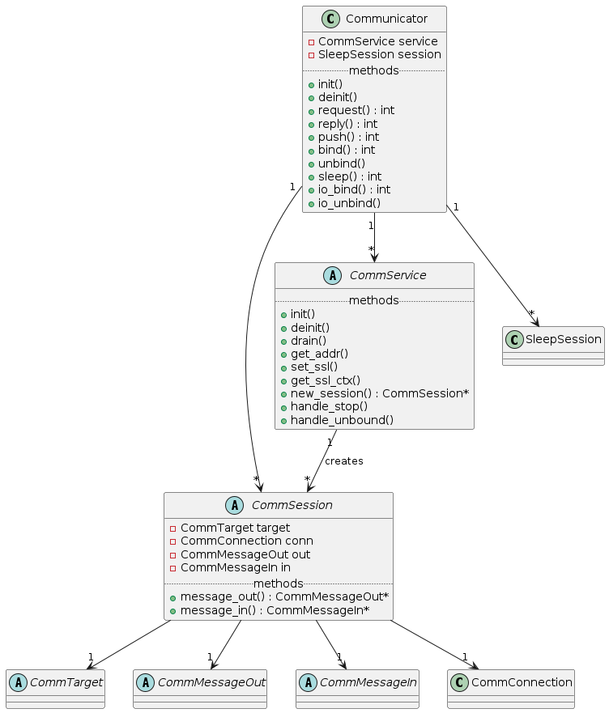

# workflow 源码解析 : WFServer

## 


##
这段C++源代码主要是定义一个网络服务器的基础类`WFServerBase`和具体的模板类`WFServer`。`WFServerBase`定义了服务器的基本参数、一系列启动和停止服务器的方法，以及一些和连接相关的操作；而`WFServer`则是基于`WFServerBase`的模板类，它根据不同的请求和响应数据类型生成具体的网络任务。这段代码是使用C++实现的基于TCP的服务器，允许使用SSL进行安全通信。

以下是一些重要部分的详细解释：

- `WFServerParams` 结构体定义了服务器的一些重要参数，包括最大连接数、接收超时、保持连接的超时、请求大小限制等。

- `WFServerBase`类定义了一系列服务器启动和停止的方法，如 `start` 和 `stop`。它的 `start` 方法允许在多种配置下启动服务器，例如指定端口、IP版本（IPv4或IPv6）、主机名、绑定地址等。如果传入了证书文件和密钥文件，那么服务器将以SSL方式启动。

- `WFServerBase` 类中的 `new_connection` 和 `delete_connection` 方法用于创建和删除连接。它维护了一个原子计数器 `conn_count` 来记录当前活跃的连接数量。

- `WFServerBase` 中的 `get_server_ssl_ctx` 方法用于获取SSL上下文，用于支持TLS SNI。服务器使用此方法来确定应该使用哪个SSL上下文处理客户端的请求。

- `WFServer`是一个模板类，根据请求和响应的类型创建具体的网络任务。它的 `new_session` 方法创建一个新的会话，根据参数 `process`（一个函数对象），为每个新的网络连接创建一个新的网络任务。  它接受一个回调函数，当收到请求时，这个回调函数将被执行。

- `WFServerConnection`类：这是一个简单的类，当每个新的连接建立时，它会更新服务器的当前连接数。

- `WFServerBase`类中的其他方法：这些方法用于初始化服务器，包括创建监听的文件描述符，初始化SSL上下文等。


## server的交互流程

从上一章我们可以看到，我们accept建立连接后，把read操作挂上了epoll监听

当事件来临，我们epoll_wait拿到这个事件

```cpp
case PD_OP_READ:
    __poller_handle_read(node, poller);
    break;
```

```cpp
static void __poller_handle_read(struct __poller_node *node,
								 poller_t *poller)
{
	while (1)
	{
        // char buf[POLLER_BUFSIZE];
		p = poller->buf;
        ...
        nleft = read(node->data.fd, p, POLLER_BUFSIZE);
        if (nleft < 0)
        {
            if (errno == EAGAIN)
                return;
        }

		if (nleft <= 0)
			break;

		do
		{
			n = nleft;
			if (__poller_append_message(p, &n, node, poller) >= 0)
			{
				nleft -= n;
				p += n;
			}
			else
				nleft = -1;
		} while (nleft > 0);

		if (nleft < 0)
			break;
	}

	if (__poller_remove_node(node, poller))
		return;

	if (nleft == 0)
	{
		node->error = 0;
		node->state = PR_ST_FINISHED;
	}
	else
	{
		node->error = errno;
		node->state = PR_ST_ERROR;
	}

	free(node->res);
    // 结果写道msgqueue
	poller->cb((struct poller_result *)node, poller->ctx);
}
```

主要是read数据到poller->buf中，然后`__poller_append_message`, 最后把结果写到msgqueue中

### __poller_append_message

```cpp

static int __poller_append_message(const void *buf, size_t *n,
								   struct __poller_node *node,
								   poller_t *poller)
{
	poller_message_t *msg = node->data.message;
	struct __poller_node *res;

	if (!msg)
	{
		res = (struct __poller_node *)malloc(sizeof (struct __poller_node));
        ...
		msg = poller->create_message(node->data.context);
        ...
		node->data.message = msg;
		node->res = res;
	}
	else
		res = node->res;

    msg->append(buf, n, msg);

    res->data = node->data;
    res->error = 0;
    res->state = PR_ST_SUCCESS;
    poller->cb((struct poller_result *)res, poller->ctx);

    node->data.message = NULL;
    node->res = NULL;
}
```

其中`node->data.message` 是 `poller_message_t *message;`

把在poller中读到的数据放进msgqueue中处理

这里有两个比较核心

1. msg = poller->create_message(node->data.context);

2. msg->append(buf, n, msg);

### create_message

```cpp
struct __poller
{
	...
	poller_message_t *(*create_message)(void *); 
	...
```

发生读事件时创建一条消息。poller既不是proactor也不是reactor，而是以完整的一条消息为交互单位。

其中的void *参数来自于struct poller_data里的void *context（注意不是poller_params里的context）。

poller_message_t是一条完整的消息，这是一个变长结构体，需要而且只需要实现append

```
note:

按理READ操作的create_message和LISTEN操作的accept是对应关系，

但是create_message是全局的（poller_params里），

而accpet却在poller_data里，非常不对称。

这个原因看我们主分枝的poller.h就明白了，poller_data里第一个union我们放了一个SSL *，

如果吧create_message放到poller_data里，SSL *就不得不独立占有一个域，那么每个poller_data会增加8个字节（64bits系统下）。
```

读操作中，poller_add时一般需要把message置为NULL（除非是续传，message指向之前的不完整消息），

context置为poller_params里create_message时的参数，

operation置为PD_OP_READ

fd则是nonblocking的文件fd。

callback以SUCCESS返回时，message指向成功读取的消息，

其它的域与poller_add传入的相同，fd的读操作继续进行。

以非SUCCESS返回时，message可能为NULL，也可能指向一个不完整的消息，fd交还用户（可以重新poller_add续传）

那么这个`create_message`究竟是什么呢

```cpp
poller_t *poller_create(const struct poller_params *params)
{
	...
	poller->create_message = params->create_message;
	...
}
```

```cpp
struct poller_params params = {
	...
	.create_message		=	Communicator::create_message,
	...
};
```

### Communicator::create_message

```cpp

poller_message_t *Communicator::create_message(void *context)
{
	struct CommConnEntry *entry = (struct CommConnEntry *)context;
	CommSession *session;

	if (entry->state == CONN_STATE_IDLE)
	{
		pthread_mutex_t *mutex;

		if (entry->service)
			mutex = &entry->target->mutex;
		else
			mutex = &entry->mutex;

		pthread_mutex_lock(mutex);
		/* do nothing */
		pthread_mutex_unlock(mutex);
	}

	if (entry->state == CONN_STATE_CONNECTED ||
		entry->state == CONN_STATE_KEEPALIVE)
	{
		if (Communicator::create_service_session(entry) < 0)
			return NULL;
	}
	else if (entry->state != CONN_STATE_RECEIVING)
	{
		errno = EBADMSG;
		return NULL;
	}

	session = entry->session;
	session->in = session->message_in();
	if (session->in)
	{
		session->in->poller_message_t::append = Communicator::append;
		session->in->entry = entry;
	}

	return session->in;
}
```

这一段主要几个重点

1. CONN_STATE_IDLE 时，啥也不做

2. create_service_session

3. session->in->poller_message_t::append = Communicator::append;

## Communicator::create_service_session

```cpp
int Communicator::create_service_session(struct CommConnEntry *entry)
{
	pthread_mutex_lock(&service->mutex);
	if (entry->state == CONN_STATE_KEEPALIVE)
		list_del(&entry->list);
	else if (entry->state != CONN_STATE_CONNECTED)
		entry = NULL;

	pthread_mutex_unlock(&service->mutex);

	session = service->new_session(entry->seq, entry->conn);
	...
	session->passive = 1;
	entry->session = session;
	session->target = target;
	session->conn = entry->conn;
	session->seq = entry->seq++;
	session->out = NULL;
	session->in = NULL;

	timeout = Communicator::first_timeout_recv(session);
	mpoller_set_timeout(entry->sockfd, timeout, entry->mpoller);
	entry->state = CONN_STATE_RECEIVING;

	((CommServiceTarget *)target)->incref();
		return 0;
	...	
}

```

这里最为重要的就是`session = service->new_session(entry->seq, entry->conn);`

我们这里的new_session实际上是

```cpp
template<class REQ, class RESP>
CommSession *WFServer<REQ, RESP>::new_session(long long seq, CommConnection *conn)
{
	using factory = WFNetworkTaskFactory<REQ, RESP>;
	WFNetworkTask<REQ, RESP> *task;

	task = factory::create_server_task(this, this->process);
	task->set_keep_alive(this->params.keep_alive_timeout);
	task->set_receive_timeout(this->params.receive_timeout);
	task->get_req()->set_size_limit(this->params.request_size_limit);

	return task;
}
```

## Communicator::handle_read_result

于是消费者msgqueue get来消费啦

```cpp
void Communicator::handle_read_result(struct poller_result *res)
{
	struct CommConnEntry *entry = (struct CommConnEntry *)res->data.context;

	if (res->state != PR_ST_MODIFIED)
	{
		if (entry->service)
			this->handle_incoming_request(res);
		else
			this->handle_incoming_reply(res);
	}
}
```

通过service来判断是否是服务端

如果是服务端肯定是处理request，客户端肯定是req发送后，接收回来的reply

我们这里是server端

## handle_incoming_request

```cpp
void Communicator::handle_incoming_request(struct poller_result *res)
{
	struct CommConnEntry *entry = (struct CommConnEntry *)res->data.context;
	CommTarget *target = entry->target;
	CommSession *session = NULL;

	switch (res->state)
	{
	case PR_ST_SUCCESS:
		session = entry->session;
		state = CS_STATE_TOREPLY;
		pthread_mutex_lock(&target->mutex);
		if (entry->state == CONN_STATE_SUCCESS)
		{
			__sync_add_and_fetch(&entry->ref, 1);
			entry->state = CONN_STATE_IDLE;
			list_add(&entry->list, &target->idle_list);
		}

		pthread_mutex_unlock(&target->mutex);
		break;
        ....

    }
    session->handle(state, res->error);

    if (__sync_sub_and_fetch(&entry->ref, 1) == 0)
    {
        this->release_conn(entry);
        ((CommServiceTarget *)target)->decref();
    }

}
```

这里最为核心的是`session->handle(state, res->error);`

## WFServerTask<REQ, RESP>::handle

```cpp
template<class REQ, class RESP>
void WFServerTask<REQ, RESP>::handle(int state, int error)
{
	....
	this->state = WFT_STATE_TOREPLY;
	this->target = this->get_target();
	new Series(this);
	this->processor.dispatch();
	...
}
```

### Series

这里和client的task一样，启动了个Series, (task都在series中执行)

这里的Series是WFServerTask的内部类，继承自SeriesWork, 增加了个`CommService`

```cpp
class Series : public SeriesWork
{
public:
	Series(WFServerTask<REQ, RESP> *task) :
		SeriesWork(&task->processor, nullptr)
	{
		this->set_last_task(task);
		this->service = task->service;
		this->service->incref();
	}

	virtual ~Series()
	{
		this->callback = nullptr;
		this->service->decref();
	}

	CommService *service;
};
```

其中CommService的ref就是引用计数啊，service需要引用计数到0才解绑完成，connection要ref=0才能释放。因为异步环境下，连接随时可能被关闭，所有需要引用计数，相当于手动shared_ptr。

注意此处`new Series(this);`, 我们把本server_task 设置为最后一个task `this->set_last_task(task)`

这里非常重要，结合后面流程看

### processor

然后调用`this->processor.dispatch()`

其中processor也是WFServerTask的内部类

```cpp
class Processor : public SubTask
{
public:
	Processor(WFServerTask<REQ, RESP> *task,
				std::function<void (WFNetworkTask<REQ, RESP> *)>& proc) :
		process(proc)
	{
		this->task = task;
	}

	virtual void dispatch()
	{
		this->process(this->task);
		this->task = NULL;	/* As a flag. get_conneciton() disabled. */
		this->subtask_done();
	}

	virtual SubTask *done()
	{
		return series_of(this)->pop();
	}

	std::function<void (WFNetworkTask<REQ, RESP> *)>& process;
	WFServerTask<REQ, RESP> *task;
} processor;
```

其中有两个重要的成员变量，一个就是我们外部自己设置的server task核心逻辑`process`，一个就是此server task

在`WFServerTask` 构造的时候已经赋值好了。

然后结合我们一般的使用，我们经常会在server_task 后面 串上其他的task

```cpp
**server_task << other_task; 
```

所以这里subtask_done后走到done，把series下一个任务取出来继续运行

### 再次梳理整个task执行次序

我们先执行`this->processor.dispatch()`, 把`process` 逻辑先执行，然后把串到server_task中的其他后续流程挨着执行，最后我们执行一开始设置为last的server task本身

```cpp
virtual void dispatch()
{
	if (this->state == WFT_STATE_TOREPLY)
	{
		/* Enable get_connection() again if the reply() call is success. */
		this->processor.task = this;
		if (this->scheduler->reply(this) >= 0)
			return;
		...
	}

	this->subtask_done();
}
```

然后这里回复response，然后subtask_done -> done(WFNetworkTask) 再次回到， 执行callback，然后销毁这个task，和client一样了

```cpp
virtual SubTask *done()
{
	SeriesWork *series = series_of(this);

	if (this->state == WFT_STATE_SYS_ERROR && this->error < 0)
	{
		this->state = WFT_STATE_SSL_ERROR;
		this->error = -this->error;
	}

	if (this->callback)
		this->callback(this);

	delete this;
	return series->pop();
}
```